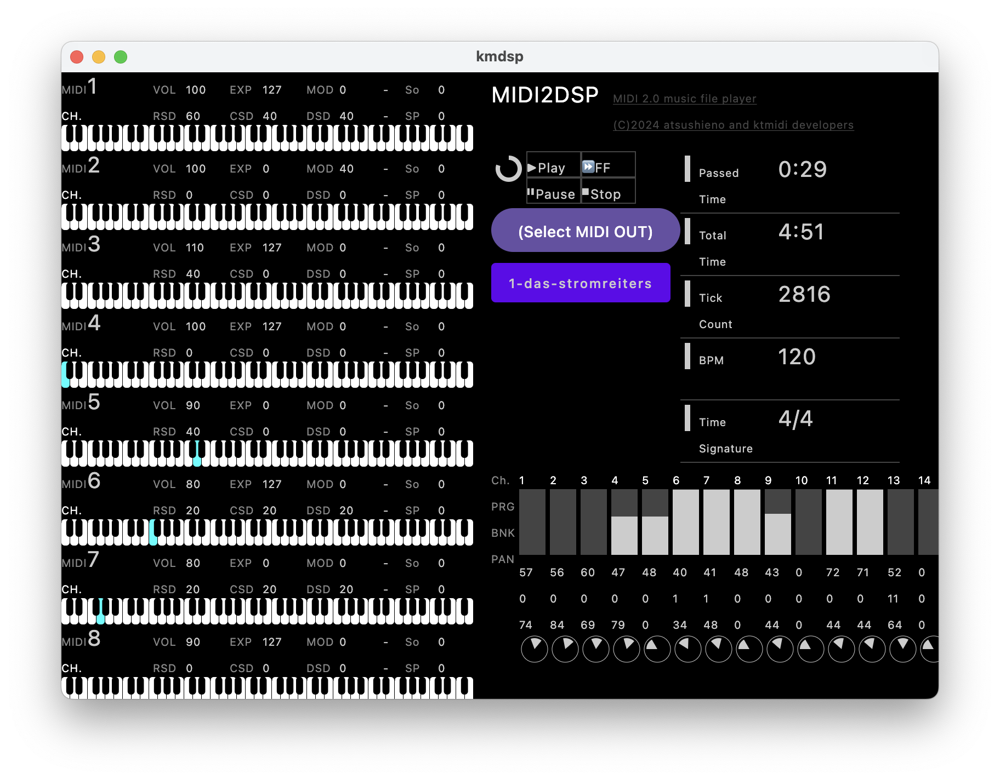

# What is this?

KMDSP is a visual SMF / MIDI 2.0 song file player based on Kotlin Multiplatform and covers JVM desktop, Android, iOS and Web using WebAssembly.

KMDSP is an updated port of atsushieno/XMDSP, which was originally inspired by ancient Japanese music players such as [MMDSP](https://github.com/gaolay/MMDSP) but to support SMF instead of FM synthesizers as of those ages.

It still does not work in many parts and on various platforms yet, but hopefully it will be, at some stage.

The MIDI player part is fully based on [ktmidi](https://github.com/atsushieno/ktmidi).

# Licenses

KMDSP is distributed under the MIT license.

