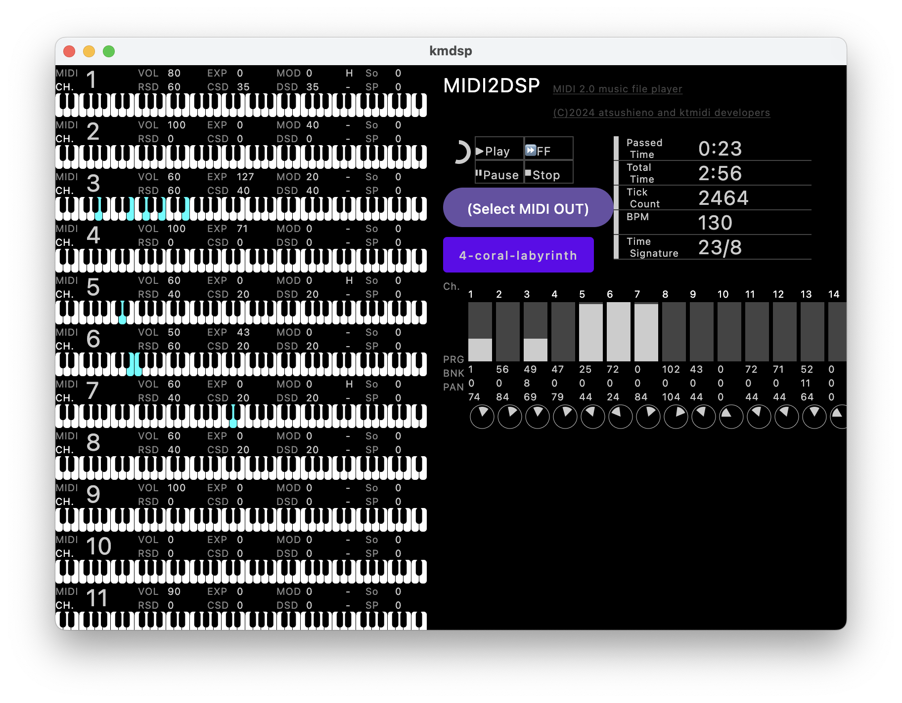

# What is this?

KMDSP is a visual SMF / MIDI 2.0 song file player based on Kotlin Multiplatform and covers JVM desktop, Android, iOS and Web using WebAssembly.

You can try the wasm version in action: https://atsushieno.github.io/kmdsp/

KMDSP is an updated port of atsushieno/XMDSP, which was originally inspired by ancient Japanese music players such as [MMDSP](https://github.com/gaolay/MMDSP) but to support SMF instead of FM synthesizers as of those ages.

It still does not work in many parts and on various platforms yet, but hopefully it will be, at some stage.

The MIDI player part is fully based on [ktmidi](https://github.com/atsushieno/ktmidi).

# Limitations

For MIDI 2.0 songs (that only ktmidi supports: umpx), parameter visualizers are not supported yet.

There is no Web MIDI 2.0 yet. You can nudge the W3C group on [their issue](https://github.com/WebAudio/web-midi-api/issues/211).

No MIDI 2.0 support on javax.sound.midi either.

No ALSA UMP support in ktmidi yet (investigating why it's not working).

These are not ported from XMDSP yet:

- panpot
- note on meters
- circular progress bar
- hot reloading of the playing song

# Licenses

KMDSP is distributed under the MIT license.

